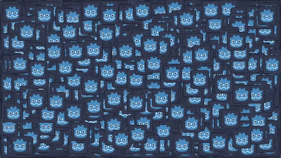
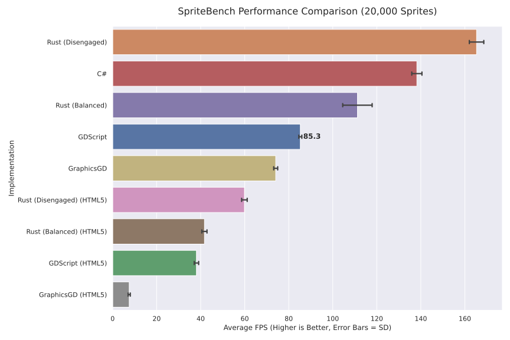

Godot Spritebench
=================

Simple benchmark that measures function call overhead in Godot for implementations in various programming languages. Spawns 20_000 2d sprites on the screen and moves them forward each frame.

Results
---------------

On Ryzen 5800X, Ubuntu 25.10, Compatibility Renderer, Radeon 7900 GRE with radeonsi, .NET 10 JIT, Godot 4.5.1

Execute
----------------

Individual projects are in `spritebench_cs` (C#), `spritebench_gdscript` (GDScript), `spritebench_graphicsgd` (Go). To run them, export them in `release` mode.

By default, 20_000 sprites will be spawned. The app runs for 100 frames, then records the frametimes for 1_000 frames. Afterwards, a text area is shown that contains the frametimes, which can be copied and pasted to a csv file. It is implemented this way so that is easy to extract the values when running the web build.