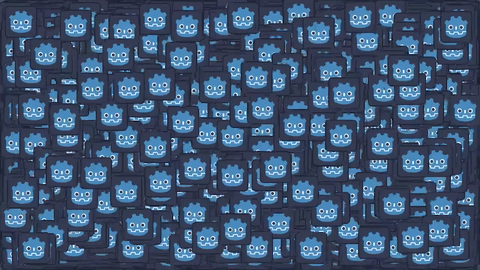
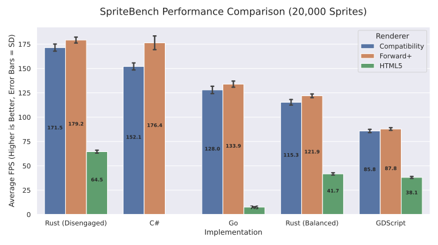

Godot Spritebench
=================

Benchmark that measures per-frame binding overhead in Godot for implementations in various programming languages. Each implementation moves 2d sprites forward every frame, and the benchmark searches for the **largest number of sprites it can sustain at the target frame rate without dropping frames**.



Results
---------------



Max sprites at the platform's target frame rate (display refresh on device,
60 fps headless/web), Godot 4.6. Measured on:

- Linux + web: AMD Ryzen 9 5900XT (16C/32T), Void Linux 7.0.12
- macOS: Apple M4 (10-core, 16 GB), macOS 26.2
- Windows: Surface Pro 6 (Intel Core i7-8650U, 8 GB), Windows 11
- Android (120 Hz): Samsung Galaxy Z Fold5 (Snapdragon 8 Gen 2), Android 16
- iOS (60 Hz): iPhone 8 (A11), iOS 16.7

A 0 bar means the language cannot target that platform.

Automated run
----------------

The entire linux + web benchmarks can be run fully automated in a container (requires
[podman](https://podman.io)):

```sh
./bench/run.sh
```

This builds every implementation, exports release builds, runs them natively
(headless) and as web builds (in headless Chromium), and writes one
result CSV per implementation plus a comparison chart to
`bench/results/<timestamp>/`. Companion runners benchmark the same tree on
real hardware: `run-macos.sh`, `run-windows.sh`, `run-android.sh`,
`run-ios.sh`. See [bench/README.md](bench/README.md) for options.

Manual run
----------------

Individual projects are in:
- `spritebench_cs`: Godot C#
- `spritebench_gdscript`: Godot GDScript
- `spritebench_cpp`: [godot-cpp](https://github.com/godotengine/godot-cpp) (C++)
- `spritebench_go`: [graphics.gd](https://github.com/quaadgras/graphics.gd) (Go)
- `spritebench_rust`: [godot-rust](https://github.com/godot-rust/gdext) (Rust)
- `spritebench_swift`: [SwiftGodot](https://github.com/migueldeicaza/SwiftGodot) (Swift)
- `spritebench_Odin`: [Toxin](https://github.com/Ferinzz/Toxin) (Odin)

To run them, build the respective extension (for Go, Rust, Swift, C++, Odin) and export them in `release` mode.

On launch the app warms up for 100 frames, then searches for the answer: 
starting from 20_000 sprites it doubles the count while the target
holds and halves it while it doesn't, binary-searches the boundary, and
re-tests the winner best-of-3. Each probe window is 40 warmup + 120 measured
frames, judged by its 99th-percentile frame time. Afterwards a text area
shows one line `<max_sprites> <target_fps> <fps_at_max>` which is easy to
copy out even from a web build.
